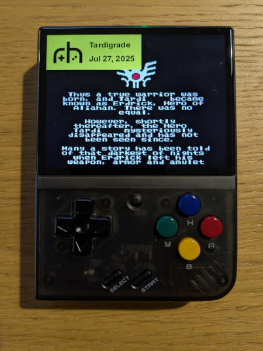

# RHCompletionMMP

This is a **Miyoo Mini Plus (OnionOS)** app, for [RetroHandhelds community](https://retrohandhelds.gg/)'s 'GotX' (Game of the Week/Month/Quarter/Year). For more details, join the RetroHandhelds [Discord server](https://retrohandhelds.link/Discord).

This app is for Miyoo Mini Plus running OnionOS only, but it should run on any device that supports python 2.7 and pygame.

For the equivalent Android app, see: [RHCompletion](https://github.com/Tardigrade-nx/RHCompletion).

It simply displays a screenshot of the ending you took before in RetroArch, with a floating note above, containing your configured nickname and the current date. With the app running, you can take your completion photo without having to write down your nickname and current date on a piece of paper.
When using the app, it is required to take a real photo, not a screenshot, and mention the name of the game on your completion post, as usual.

Here's an example of a completion photo using the app:

## Installation

- Download and uncompress the ZIP file from the [latest release](https://github.com/Tardigrade-nx/RHCompletionMMP/releases/latest).
- In the 'RHCompletionMMP' folder, edit file 'RHCompletionMMP_config.json' and configure your nickname (same as the one used on Discord).
- Copy folder 'RHCompletionMMP' on the SD Card of your Miyoo Mini Plus, in the 'App' folder. A new 'RH Completion' app should appear in the 'Apps' menu. If not, launch the Package Manager and exit to force a refresh.
- Make sure that the system date is correct on the Miyoo Mini Plus: Apps > Tweaks > System > Date and time.

## Usage

- From the emulator, take a screenshot of the ending sequence. By default on OnionOS, this can be done with MENU + POWER.
- Exit RetroArch, and launch: Apps > RH Completion. The last screenshot taken should be displayed, with the floating note above. See buttons below for further actions. You can now take your completion photo and post it on Discord.

## Buttons
- ⬆️⬇️: Select screenshot
- 🇦: Enable/disable image stretch
- 🇧: Exit
